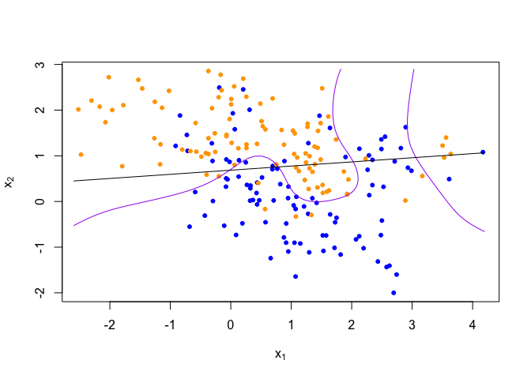
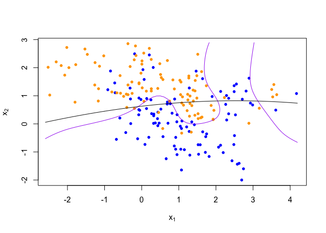
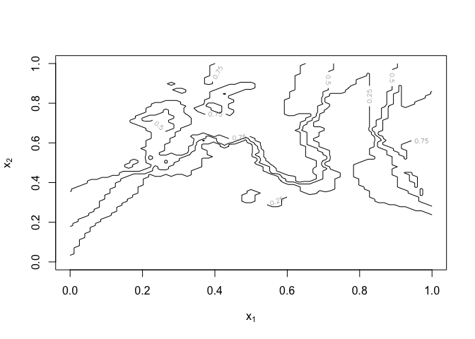
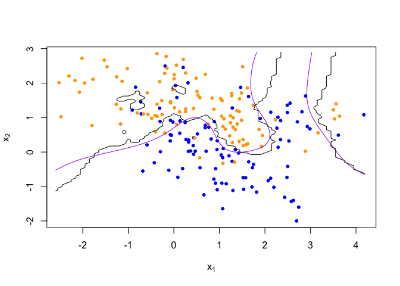
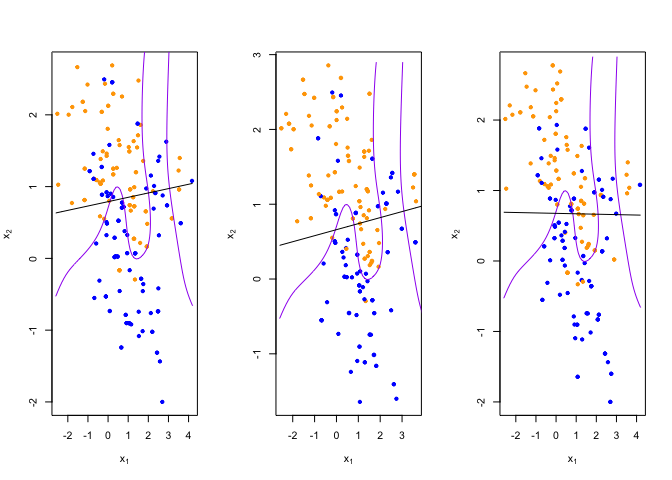
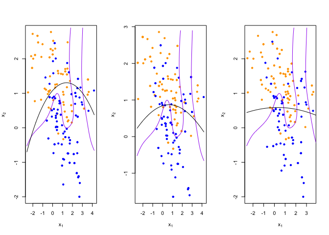
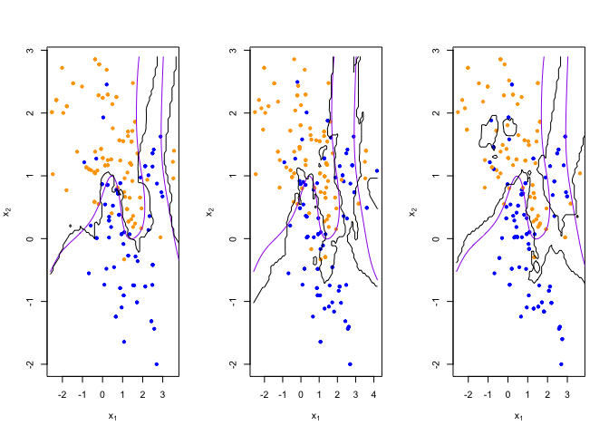
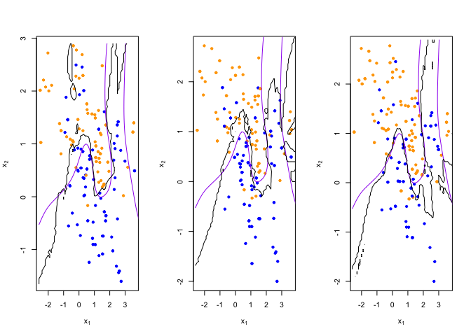

Homework 1
================
Ningyu Han
2023-01-18

``` r
library('class')
library('dplyr')
```

    ## 
    ## Attaching package: 'dplyr'

    ## The following objects are masked from 'package:stats':
    ## 
    ##     filter, lag

    ## The following objects are masked from 'package:base':
    ## 
    ##     intersect, setdiff, setequal, union

``` r
## load binary classification example data from author website 
## 'ElemStatLearn' package no longer available
load(url('https://web.stanford.edu/~hastie/ElemStatLearn/datasets/ESL.mixture.rda'))
dat <- ESL.mixture
```

``` r
plot_mix_data <- function(dat, datboot=NULL) {
  if(!is.null(datboot)) {
    dat$x <- datboot$x
    dat$y <- datboot$y
  }
  plot(dat$x[,1], dat$x[,2],
       col=ifelse(dat$y==0, 'blue', 'orange'),
       pch=20,
       xlab=expression(x[1]),
       ylab=expression(x[2]))
  ## draw Bayes (True) classification boundary
  prob <- matrix(dat$prob, length(dat$px1), length(dat$px2))
  cont <- contourLines(dat$px1, dat$px2, prob, levels=0.5)
  rslt <- sapply(cont, lines, col='purple')
}

plot_mix_data(dat)
```

<!-- -->

``` r
## fit linear classifier
fit_lc <- function(y, x) {
  # x <- cbind(1, x)
  # beta <- drop(solve(t(x)%*%x)%*%t(x)%*%y)
  ## dat <- data.frame(y=y,x=x)
  ## fit <- lm(y ~ x1 + x2, data = dat)
  ## fit <- lm(y ~ x1 + x2 + I(x2^2), data = dat)
  ## coefficients(fit)
  ## fit
  beta <- lm(y ~ x)
}

fit_lc_new <- function(y, x){
  x1 = (x[,1])^2
  x2 = (x[,2])^2
  beta <- lm(y ~ x + x1 + x2)
}
```

``` r
## make predictions from linear classifier
predict_lc <- function(x, beta) {
  # cbind(1, x) %*% beta
  # predict(fit, data.frame(x))
  cbind(1,x) %*% beta$coefficients
}

predict_lc_new <- function(x, beta) {
  cbind(1,x, x[,1]^2, x[,2]^2) %*% beta$coefficients
}
```

``` r
## fit model to mixture data and make predictions
lc_beta <- fit_lc(dat$y, dat$x)
lc_pred <- predict_lc(dat$xnew, lc_beta)

## 
lc_beta_new <- fit_lc_new(dat$y, dat$x)
lc_pred_new <- predict_lc_new(dat$xnew, lc_beta_new)
```

``` r
## reshape predictions as a matrix
lc_pred <- matrix(lc_pred, length(dat$px1), length(dat$px2))
contour(lc_pred,
      xlab=expression(x[1]),
      ylab=expression(x[2]))
```

<!-- -->

``` r
## find the contours in 2D space such that lc_pred == 0.5
lc_cont <- contourLines(dat$px1, dat$px2, lc_pred, levels=0.5)

## plot data and decision surface
plot_mix_data(dat)
sapply(lc_cont, lines)
```

<!-- -->

    ## [[1]]
    ## NULL

``` r
# after adding square terms
lc_pred_new <- matrix(lc_pred_new, length(dat$px1), length(dat$px2))
contour(lc_pred_new,
      xlab=expression(x[1]),
      ylab=expression(x[2]))
```

<!-- -->

``` r
lc_cont_new <- contourLines(dat$px1, dat$px2, lc_pred_new, levels=0.5)

plot_mix_data(dat)
sapply(lc_cont_new, lines)
```

<!-- -->

    ## [[1]]
    ## NULL

``` r
## fit knn classifier
## use 5-NN to estimate probability of class assignment
knn_fit <- knn(train=dat$x, test=dat$xnew, cl=dat$y, k=5, prob=TRUE)
knn_pred <- attr(knn_fit, 'prob')
knn_pred <- ifelse(knn_fit == 1, knn_pred, 1-knn_pred)

## reshape predictions as a matrix
knn_pred <- matrix(knn_pred, length(dat$px1), length(dat$px2))
contour(knn_pred,
        xlab=expression(x[1]),
        ylab=expression(x[2]),
        levels=c(0.25, 0.5, 0.75))
```

<!-- -->

``` r
## find the contours in 2D space such that knn_pred == 0.5
knn_cont <- contourLines(dat$px1, dat$px2, knn_pred, levels=0.5)

## plot data and decision surface
plot_mix_data(dat)
sapply(knn_cont, lines)
```

<!-- -->

    ## [[1]]
    ## NULL
    ## 
    ## [[2]]
    ## NULL
    ## 
    ## [[3]]
    ## NULL
    ## 
    ## [[4]]
    ## NULL
    ## 
    ## [[5]]
    ## NULL

``` r
## do bootstrap to get a sense of variance in decision surface
resample <- function(dat) {
  idx <- sample(1:length(dat$y), replace = T)
  dat$y <- dat$y[idx]
  dat$x <- dat$x[idx,]
  return(dat)
}
  
## plot linear classifier for three bootstraps
par(mfrow=c(1,3))
for(b in 1:3) {
  datb <- resample(dat)
  ## fit model to mixture data and make predictions
  lc_beta <- fit_lc(datb$y, datb$x)
  lc_pred <- predict_lc(datb$xnew, lc_beta)
  
  ## reshape predictions as a matrix
  lc_pred <- matrix(lc_pred, length(datb$px1), length(datb$px2))

  ## find the contours in 2D space such that lc_pred == 0.5
  lc_cont <- contourLines(datb$px1, datb$px2, lc_pred, levels=0.5)
  
  ## plot data and decision surface
  plot_mix_data(dat, datb)
  sapply(lc_cont, lines)
}
```

<!-- -->

``` r
# after adding square terms
par(mfrow=c(1,3))
for(b in 1:3) {
  datb <- resample(dat)
  
  lc_beta_new <- fit_lc_new(datb$y, datb$x)
  lc_pred_new <- predict_lc_new(datb$xnew, lc_beta_new)
  
  lc_pred_new <- matrix(lc_pred_new, length(datb$px1), length(datb$px2))
  
  lc_cont_new <- contourLines(datb$px1, datb$px2, lc_pred_new, levels=0.5)

  plot_mix_data(dat, datb)
  sapply(lc_cont_new, lines)
}
```

<!-- -->

``` r
## plot 5-NN classifier for three bootstraps
par(mfrow=c(1,3))
for(b in 1:3) {
  datb <- resample(dat)
  
  knn_fit <- knn(train=datb$x, test=datb$xnew, cl=datb$y, k=5, prob=TRUE)
  knn_pred <- attr(knn_fit, 'prob')
  knn_pred <- ifelse(knn_fit == 1, knn_pred, 1-knn_pred)
  
  ## reshape predictions as a matrix
  knn_pred <- matrix(knn_pred, length(datb$px1), length(datb$px2))

  ## find the contours in 2D space such that knn_pred == 0.5
  knn_cont <- contourLines(datb$px1, datb$px2, knn_pred, levels=0.5)
  
  ## plot data and decision surface
  plot_mix_data(dat, datb)
  sapply(knn_cont, lines)
}
```

<!-- -->

``` r
## plot 20-NN classifier for three bootstraps
par(mfrow=c(1,3))
for(b in 1:3) {
  datb <- resample(dat)
  
  knn_fit <- knn(train=datb$x, test=datb$xnew, cl=datb$y, k=20, prob=TRUE)
  knn_pred <- attr(knn_fit, 'prob')
  knn_pred <- ifelse(knn_fit == 1, knn_pred, 1-knn_pred)
  
  ## reshape predictions as a matrix
  knn_pred <- matrix(knn_pred, length(datb$px1), length(datb$px2))
  
  ## find the contours in 2D space such that knn_pred == 0.5
  knn_cont <- contourLines(datb$px1, datb$px2, knn_pred, levels=0.5)
  
  ## plot data and decision surface
  plot_mix_data(dat, datb)
  sapply(knn_cont, lines)
}
```

<!-- -->

**Describe how this more flexible model affects the bias-variance
tradeoff**

Comparing the output figures, I find that after adding the square terms,
it seems that the bias of the model is lowered, but the variance
increases. That is, the prediction is closer to the actual result but
exacerbates differences between the 3 bootstraps. However, this new
model is more flexible because it has lower biases with a variance that
is not very high.
