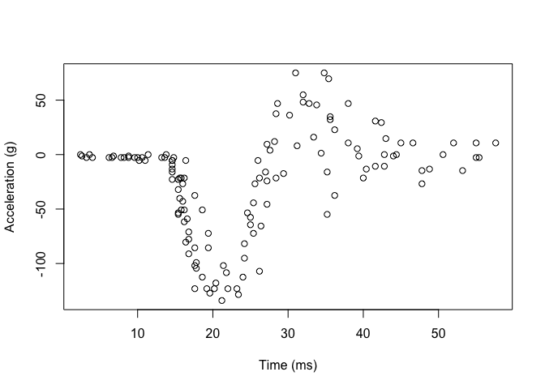
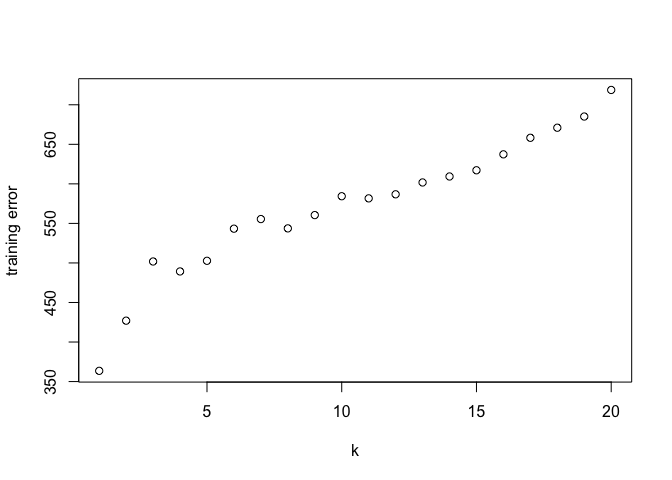
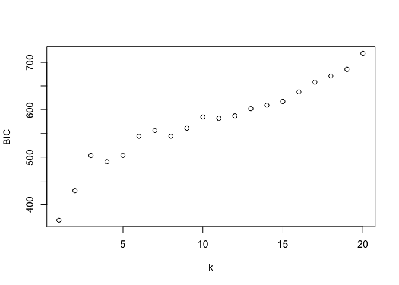
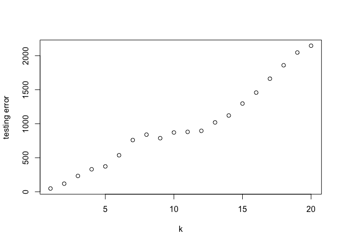
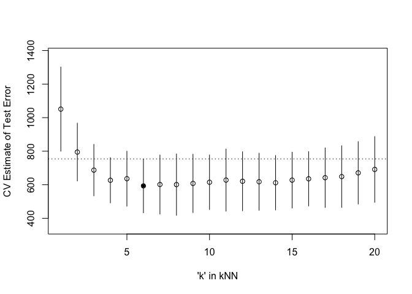

Homework_4
================
Ningyu Han
2023-02-27

``` r
library('MASS') ## for 'mcycle'
library('manipulate') ## for 'manipulate'
library('manipulate')
library('splines') ## 'ns'
library('caret') ## 'knnreg' and 'createFolds'
```

    ## Loading required package: ggplot2

    ## Loading required package: lattice

``` r
y <- mcycle$accel
x <- matrix(mcycle$times, length(mcycle$times), 1)

plot(x, y, xlab="Time (ms)", ylab="Acceleration (g)")
```

<!-- -->

## Randomly split the mcycle data into training (75%) and validation (25%) subsets.

``` r
dat <- mcycle
set.seed(123)

n <- nrow(dat)
train_indices <- sample(1:n, round(0.75*n), replace = FALSE)
mcycle_train <- mcycle[train_indices, ]
mcycle_test <- mcycle[-train_indices, ]
```

``` r
y_valid <- mcycle_test$accel
x_valid <- matrix(mcycle_test$times, length(mcycle_test$times), 1)

plot(x_valid, y_valid, xlab="Time (ms)", ylab="Acceleration (g)")
```

<!-- -->

## Using the mcycle data, consider predicting the mean acceleration as a function of time. Use the Nadaraya-Watson method with the k-NN kernel function to create a series of prediction models by varying the tuning parameter over a sequence of values. (hint: the script already implements this)

``` r
## Epanechnikov kernel function
## x  - n x p matrix of training inputs
## x0 - 1 x p input where to make prediction
## lambda - bandwidth (neighborhood size)
kernel_epanechnikov <- function(x, x0, lambda=1) {
  d <- function(t)
    ifelse(t <= 1, 3/4*(1-t^2), 0)
  z <- t(t(x) - x0)
  d(sqrt(rowSums(z*z))/lambda)
}
```

``` r
## k-NN kernel function
## x  - n x p matrix of training inputs
## x0 - 1 x p input where to make prediction
## k  - number of nearest neighbors
kernel_k_nearest_neighbors <- function(x, x0, knn=1) {
  ## compute distance betwen each x and x0
  z <- t(t(x) - x0)
  d <- sqrt(rowSums(z*z))

  ## initialize kernel weights to zero
  w <- rep(0, length(d))
  
  ## set weight to 1 for k nearest neighbors
  w[order(d)[1:knn]] <- 1
  
  return(w)
}
```

``` r
## Make predictions using the NW method
## y  - n x 1 vector of training outputs
## x  - n x p matrix of training inputs
## x0 - m x p matrix where to make predictions
## kern  - kernel function to use
## ... - arguments to pass to kernel function
nadaraya_watson <- function(y, x, x0, kern, ...) {
  k <- t(apply(x0, 1, function(x0_) {
    k_ <- kern(x, x0_, ...)
    k_/sum(k_)
  }))
  yhat <- drop(k %*% y)
  attr(yhat, 'k') <- k
  return(yhat)
}

yhat <- nadaraya_watson(y, x, x,kernel_k_nearest_neighbors, knn=1)
```

``` r
## Helper function to view kernel (smoother) matrix
matrix_image <- function(x) {
  rot <- function(x) t(apply(x, 2, rev))
  cls <- rev(gray.colors(20, end=1))
  image(rot(x), col=cls, axes=FALSE)
  xlb <- pretty(1:ncol(x))
  xat <- (xlb-0.5)/ncol(x)
  ylb <- pretty(1:nrow(x))
  yat <- (ylb-0.5)/nrow(x)
  axis(3, at=xat, labels=xlb)
  axis(2, at=yat, labels=ylb)
  mtext('Rows', 2, 3)
  mtext('Columns', 3, 3)
}

matrix_image(attr(yhat, 'k'))
```

<!-- -->

## With the squared-error loss function, compute and plot the training error, AIC, BIC, and validation error (using the validation data) as functions of the tuning parameter.

``` r
## Compute effective df using NW method
## y  - n x 1 vector of training outputs
## x  - n x p matrix of training inputs
## kern  - kernel function to use
## ... - arguments to pass to kernel function
effective_df <- function(y, x, kern, ...) {
  y_hat <- nadaraya_watson(y, x, x,
    kern=kern, ...)
  sum(diag(attr(y_hat, 'k')))
}
```

``` r
x_train = matrix(mcycle_train$times, length(mcycle_train$times), 1)
yhat_train = nadaraya_watson(mcycle_train$accel, x_train, x_train, kernel_k_nearest_neighbors, knn=1)
```

``` r
## loss function
## y    - train/test y
## yhat - predictions at train/test x
  
loss_squared_error <- function(y, yhat)
  (y - yhat)^2

## test/train error
## y    - train/test y
## yhat - predictions at train/test x
## loss - loss function
error <- function(y, yhat, loss=loss_squared_error)
  mean(loss(y, yhat))

train_error <- rep(NA, 50)
for (i in 1:50){
  yhat_train <- nadaraya_watson(mcycle_train$accel, x_train, x_train, kernel_k_nearest_neighbors, knn = i)
  train_error[i] <- error(mcycle_train$accel, yhat_train, loss = loss_squared_error)
}

plot(seq(1:50),train_error, xlab = "k", ylab = "training error")
```

<!-- -->

``` r
y = mcycle_train$times
x <- x_train

## AIC
## y    - training y
## yhat - predictions at training x
## d    - effective degrees of freedom
aic <- function(y, yhat, d)
  error(y, yhat) + 2/length(y)*d

## BIC
## y    - training y
## yhat - predictions at training x
## d    - effective degrees of freedom

bic <- function(y, yhat, d)
  error(y, yhat) + log(length(y))/length(y)*d

## make predictions using NW method at training inputs
yhat <- nadaraya_watson(y, x, x,
  kernel_epanechnikov, lambda=5)

## view kernel (smoother) matrix
matrix_image(attr(yhat, 'k'))
```

<!-- -->

``` r
## compute effective degrees of freedom
edf <- effective_df(y, x, kernel_epanechnikov, lambda=5)
aic(y, yhat, edf)
```

    ## [1] 0.6409796

``` r
bic(y, yhat, edf)
```

    ## [1] 0.8627817

``` r
aic_error <- rep(NA, 50)
for(i in 1:50){
  yhat_train <- nadaraya_watson(mcycle_train$accel, x_train, x_train,kernel_k_nearest_neighbors, knn=i)
  edf <- effective_df(y, x, kernel_k_nearest_neighbors, knn=i)
  aic_error[i] <-  aic(y, yhat_train, edf)
}
print(aic_error)
```

    ##  [1] 5091.475 4271.287 4337.480 4012.961 3836.631 3928.073 3992.422 3991.655
    ##  [9] 3956.766 3856.233 3757.818 3743.931 3721.539 3614.656 3530.737 3509.427
    ## [17] 3487.257 3426.842 3365.450 3312.003 3217.977 3249.191 3156.968 3190.671
    ## [25] 3156.539 3163.198 3184.374 3160.830 3154.303 3155.732 3136.818 3163.030
    ## [33] 3231.683 3271.446 3297.095 3355.372 3382.827 3428.669 3467.208 3466.856
    ## [41] 3507.944 3548.435 3596.819 3637.390 3663.047 3707.719 3779.969 3818.837
    ## [49] 3857.116 3920.321

``` r
plot(seq(1:50), aic_error, xlab = 'k',ylab = 'AIC')
```

<!-- -->

``` r
bic_error <- rep(NA, 50)
for(i in 1:50){
  yhat_train <- nadaraya_watson(mcycle_train$accel, x_train, x_train,kernel_k_nearest_neighbors, knn=i)
  edf <- effective_df(y, x, kernel_k_nearest_neighbors, knn=i)
  bic_error[i] <- bic(y, yhat_train, edf)
}
print(bic_error)
```

    ##  [1] 5093.377 4272.499 4338.322 4013.605 3837.152 3928.507 3992.795 3991.981
    ##  [9] 3957.056 3856.494 3758.054 3744.148 3721.740 3614.843 3530.910 3509.589
    ## [17] 3487.411 3426.986 3365.587 3312.133 3218.101 3249.310 3157.082 3190.780
    ## [25] 3156.643 3163.298 3184.471 3160.923 3154.393 3155.818 3136.902 3163.111
    ## [33] 3231.762 3271.522 3297.169 3355.445 3382.897 3428.738 3467.275 3466.921
    ## [41] 3508.008 3548.497 3596.879 3637.449 3663.105 3707.775 3780.024 3818.891
    ## [49] 3857.170 3920.373

``` r
plot(seq(1:50), bic_error, xlab = 'k',ylab = 'BIC')
```

<!-- -->

``` r
valid_error <- rep(NA, 50)
for(i in 1:50){
  yhat_valid <- nadaraya_watson(mcycle_test$accel, x_valid, x_valid,kernel_k_nearest_neighbors, knn=i)
  valid_error[i] <-  error(mcycle_test$accel,yhat_valid)
}

#Error
#training error
plot(seq(1:50), valid_error, xlab = 'k', ylab = 'testing error')
```

<!-- -->

``` r
## create a grid of inputs 
x_plot <- matrix(seq(min(x),max(x),length.out=100),100,1)

## make predictions using NW method at each of grid points
y_hat_plot <- nadaraya_watson(y, x, x_plot,
  kernel_epanechnikov, lambda=1)

## plot predictions
plot(x, y, xlab="Time (ms)", ylab="Acceleration (g)")
lines(x_plot, y_hat_plot, col="#882255", lwd=2) 
```

<!-- -->

``` r
# # how does k affect shape of predictor and eff. df using k-nn kernel ?
# manipulate({
#   ## make predictions using NW method at training inputs
#   y_hat <- nadaraya_watson(y, x, x,
#     kern=kernel_k_nearest_neighbors, k=k_slider)
#   edf <- effective_df(y, x,
#     kern=kernel_k_nearest_neighbors, k=k_slider)
#   aic_ <- aic(y, y_hat, edf)
#   bic_ <- bic(y, y_hat, edf)
#   y_hat_plot <- nadaraya_watson(y, x, x_plot,
#     kern=kernel_k_nearest_neighbors, k=k_slider)
#   plot(x, y, xlab="Time (ms)", ylab="Acceleration (g)")
#   legend('topright', legend = c(
#     paste0('eff. df = ', round(edf,1)),
#     paste0('aic = ', round(aic_, 1)),
#     paste0('bic = ', round(bic_, 1))),
#     bty='n')
#   lines(x_plot, y_hat_plot, col="#882255", lwd=2)
# }, k_slider=slider(1, 10, initial=3, step=1))
```

## For each value of the tuning parameter, Perform 5-fold cross-validation using the combined training and validation data. This results in 5 estimates of test error per tuning parameter value.

``` r
## 5-fold cross-validation of knnreg model
## create five folds
set.seed(1985)
mcycle_flds  <- createFolds(mcycle$times, k=5)
print(mcycle_flds)
```

    ## $Fold1
    ##  [1]   4   7  10  12  13  22  26  40  44  53  54  57  60  69  73  76  80  84  93
    ## [20] 100 118 120 122 129 130 132
    ## 
    ## $Fold2
    ##  [1]   3  15  16  21  28  32  34  43  47  48  49  51  55  59  83  85  87  89  92
    ## [20]  96  98 104 112 116 117 125 131
    ## 
    ## $Fold3
    ##  [1]   2  11  14  19  25  31  36  42  46  50  52  66  67  75  77  79  88  91  97
    ## [20] 101 105 109 111 121 126 127
    ## 
    ## $Fold4
    ##  [1]   6   8   9  17  29  30  33  35  38  39  45  64  65  70  71  74  81  82  94
    ## [20]  99 102 103 106 108 114 124 133
    ## 
    ## $Fold5
    ##  [1]   1   5  18  20  23  24  27  37  41  56  58  61  62  63  68  72  78  86  90
    ## [20]  95 107 110 113 115 119 123 128

``` r
sapply(mcycle_flds, length)  ## not all the same length
```

    ## Fold1 Fold2 Fold3 Fold4 Fold5 
    ##    26    27    26    27    27

``` r
cvknnreg <- function(kNN = 10, flds=mcycle_flds) {
  cverr <- rep(NA, length(flds))
  for(tst_idx in 1:length(flds)) { ## for each fold
    
    ## get training and testing data
    mcycle_trn <- mcycle[-flds[[tst_idx]],]
    mcycle_tst <- mcycle[ flds[[tst_idx]],]
    
    ## fit kNN model to training data
    knn_fit <- knnreg(accel ~ times,
                      k=kNN, data=mcycle_trn)
    
    ## compute test error on testing data
    pre_tst <- predict(knn_fit, mcycle_tst)
    cverr[tst_idx] <- mean((mcycle_tst$accel - pre_tst)^2)
  }
  return(cverr)
}

## Compute 5-fold CV for kNN = 1:50
cverrs <- sapply(1:50, cvknnreg)
print(cverrs) ## rows are k-folds (1:5), cols are kNN (1:50)
```

    ##           [,1]      [,2]     [,3]     [,4]     [,5]     [,6]     [,7]     [,8]
    ## [1,]  873.7206  700.0270 689.3987 485.3409 434.3789 395.7523 363.1052 359.1610
    ## [2,] 1270.1977  875.9311 663.4668 680.9788 726.2984 668.5983 697.4114 690.2885
    ## [3,] 1372.8886  716.4393 679.7326 687.8899 673.3354 636.9632 651.5842 632.1199
    ## [4,]  905.4988 1056.9299 917.4261 791.3737 838.6811 795.8138 807.7914 833.1298
    ## [5,]  832.2273  625.6535 485.9449 488.5612 507.9257 469.1820 487.2257 489.8112
    ##          [,9]    [,10]    [,11]    [,12]    [,13]    [,14]    [,15]    [,16]
    ## [1,] 368.4566 375.3212 369.9732 352.7022 364.5059 386.6813 382.1285 372.2810
    ## [2,] 727.3307 739.7056 718.3590 725.5623 720.8505 762.2420 778.9767 720.5379
    ## [3,] 647.5598 657.6890 734.9424 688.5695 682.5284 684.5491 729.4468 753.2387
    ## [4,] 797.8092 770.4313 815.1868 794.5416 789.8681 728.4384 717.4297 745.2519
    ## [5,] 498.3470 531.5351 500.5685 542.4821 532.3482 497.1585 529.9872 586.2051
    ##         [,17]    [,18]    [,19]    [,20]    [,21]     [,22]     [,23]     [,24]
    ## [1,] 354.1053 347.2541 384.5101 394.2038 441.4549  472.8756  498.2082  536.6689
    ## [2,] 740.5859 799.7265 870.8813 912.4776 980.3243 1018.9970 1013.8565 1057.1217
    ## [3,] 789.3431 759.4425 753.5538 778.6373 846.6821  857.7259  937.7607  942.8272
    ## [4,] 737.8144 734.2257 743.0353 752.7634 783.9099  797.1429  803.8569  816.7285
    ## [5,] 588.0262 601.9674 602.1801 618.6925 691.5039  705.0992  713.9096  833.4163
    ##          [,25]     [,26]     [,27]     [,28]     [,29]     [,30]     [,31]
    ## [1,]  537.5714  589.7705  575.4077  619.2707  658.6125  690.0895  684.0299
    ## [2,] 1148.1801 1197.8311 1212.0159 1240.3222 1287.9730 1336.3738 1337.3155
    ## [3,]  937.5117  935.4956  956.6576  952.6449 1053.1621 1106.1121 1110.2986
    ## [4,]  808.2498  820.6746  826.2055  849.0976  864.5926  873.0770  881.2134
    ## [5,]  868.2132  874.9318  904.0628  972.2048  983.3825 1005.0191 1009.8073
    ##          [,32]     [,33]     [,34]     [,35]     [,36]     [,37]     [,38]
    ## [1,]  711.6710  741.5186  756.7934  769.2446  846.4486  851.4993  855.1789
    ## [2,] 1358.9550 1353.9986 1405.0661 1469.4552 1518.7744 1510.8004 1492.8121
    ## [3,] 1125.5663 1138.0265 1150.2618 1189.9300 1202.4104 1232.5070 1255.7036
    ## [4,]  950.0801  953.9638  999.2605 1013.6289 1051.1767 1096.3494 1128.5114
    ## [5,] 1009.2723 1067.8505 1068.6263 1104.7766 1114.6448 1142.6521 1162.3306
    ##          [,39]     [,40]     [,41]     [,42]     [,43]    [,44]    [,45]
    ## [1,]  926.3261  941.2742  959.6788  965.4947  993.8559 1014.526 1067.428
    ## [2,] 1576.1370 1630.4905 1666.1896 1676.6185 1724.6503 1772.390 1807.521
    ## [3,] 1300.8959 1325.8375 1344.4075 1357.8994 1387.0314 1416.609 1465.042
    ## [4,] 1133.5681 1141.7609 1165.9123 1193.7147 1201.1609 1200.754 1258.704
    ## [5,] 1245.3851 1245.6822 1269.7360 1310.8467 1320.2260 1343.473 1413.952
    ##         [,46]    [,47]    [,48]    [,49]    [,50]
    ## [1,] 1125.491 1165.090 1185.334 1248.291 1314.505
    ## [2,] 1841.461 1927.744 2004.886 2028.630 2076.517
    ## [3,] 1512.596 1543.608 1588.178 1625.597 1658.267
    ## [4,] 1289.186 1311.340 1354.635 1453.068 1506.978
    ## [5,] 1423.691 1478.891 1510.323 1589.599 1647.327

``` r
cverrs_mean <- apply(cverrs, 2, mean)
cverrs_sd   <- apply(cverrs, 2, sd)
```

## Plot the CV-estimated test error (average of the five estimates from each fold) as a function of the tuning parameter. Add vertical line segments to the figure (using the segments function in R) that represent one “standard error” of the CV-estimated test error (standard deviation of the five estimates from each fold).

``` r
## Plot the results of 5-fold CV for kNN = 1:50
plot(x=1:50, y=cverrs_mean, 
     ylim=range(cverrs),
     xlab="'k' in kNN", ylab="CV Estimate of Test Error")
segments(x0=1:50, x1=1:50,
         y0=cverrs_mean-cverrs_sd,
         y1=cverrs_mean+cverrs_sd)
best_idx <- which.min(cverrs_mean)
points(x=best_idx, y=cverrs_mean[best_idx], pch=20)
abline(h=cverrs_mean[best_idx] + cverrs_sd[best_idx], lty=3)
```

<!-- -->

## Interpret the resulting figures and select a suitable value for the tuning parameter.

**As we can see in the plot above, when k = 6, the model has the lowest
test error. However, when you look at the cverrs_mean and cverrs_sd, we
find that, when k = 4, it has the lowest standard deviation 134.9745,
its test error is also low. As a result, I think k = 4 may be a suitable
value for the tuning parameter.**
