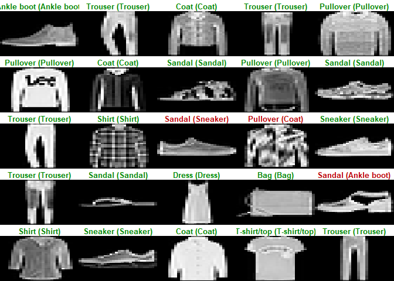

Homework 6
================
Ningyu Han
2023-04-12

``` r
library(reticulate)
path_to_python <- "D:/Anaconda3/python.exe"
virtualenv_create("r-reticulate", python = path_to_python)
```

    ## virtualenv: r-reticulate

``` r
library(tensorflow)
library(keras)
library(tensorflow)
```

``` r
#reticulate::install_miniconda()
Sys.setenv(RETICULATE_PYTHON="C:/Users/hanni/AppData/Local/r-miniconda/envs/r-reticulate/python.exe")
#install_tensorflow(method="conda", envname = "r-reticulate")
#library(tensorflow)
#install_keras(method="conda", envname = "r-reticulate")
#library(keras)
```

``` r
#tf$constant("Hello Tensorflow!")
```

## Work through the “Image Classification” tutorial on the RStudio Keras website.

``` r
fashion_mnist <- dataset_fashion_mnist()
c(train_images, train_labels) %<-% fashion_mnist$train
c(test_images, test_labels) %<-% fashion_mnist$test
```

``` r
class_names = c('T-shirt/top',
                'Trouser',
                'Pullover',
                'Dress',
                'Coat',
                'Sandal',
                'Shirt',
                'Sneaker',
                'Bag',
                'Ankle boot')
```

``` r
dim(train_images)
```

    ## [1] 60000    28    28

``` r
dim(train_labels)
```

    ## [1] 60000

``` r
train_labels[1:20]
```

    ##  [1] 9 0 0 3 0 2 7 2 5 5 0 9 5 5 7 9 1 0 6 4

``` r
library(tidyr)
library(ggplot2)
image_1 <- as.data.frame(train_images[1, , ])
colnames(image_1) <- seq_len(ncol(image_1))
image_1$y <- seq_len(nrow(image_1))
image_1 <- gather(image_1, "x", "value", -y)
image_1$x <- as.integer(image_1$x)
ggplot(image_1, aes(x = x, y = y, fill = value)) +
  geom_tile() +
  scale_fill_gradient(low = "white", high = "black", na.value = NA) +
  scale_y_reverse() +
  theme_minimal() +
  theme(panel.grid = element_blank())   +
  theme(aspect.ratio = 1) +
  xlab("") +
  ylab("")
```

<!-- -->

``` r
train_images <- train_images / 255
test_images <- test_images / 255
```

``` r
par(mfcol=c(5,5))
par(mar=c(0, 0, 1.5, 0), xaxs='i', yaxs='i')
for (i in 1:25) {
  img <- train_images[i, , ]
  img <- t(apply(img, 2, rev))
  image(1:28, 1:28, img, col = gray((0:255)/255), xaxt = 'n', yaxt = 'n',
        main = paste(class_names[train_labels[i] + 1]))
}
```

<!-- -->

``` r
model <- keras_model_sequential()
model %>%
  layer_flatten(input_shape = c(28, 28)) %>%
  layer_dense(units = 128, activation = 'relu') %>%
  layer_dense(units = 10, activation = 'softmax')
```

``` r
model %>% compile(
  optimizer = 'adam',
  loss = 'sparse_categorical_crossentropy',
  metrics = c('accuracy')
)
```

``` r
model %>% fit(train_images, train_labels, epochs = 5, verbose = 2)
```

``` r
score <- model %>% evaluate(test_images, test_labels, verbose = 0)
cat('Test loss:', score["loss"], "\n")
```

    ## Test loss: 0.3416547

``` r
cat('Test accuracy:', score["accuracy"], "\n")
```

    ## Test accuracy: 0.878

``` r
predictions <- model %>% predict(test_images)
predictions[1, ]
```

    ##  [1] 1.430118e-05 2.176071e-08 1.318801e-06 4.190541e-06 4.926423e-06
    ##  [6] 1.200314e-01 1.591413e-05 7.475515e-03 2.284282e-04 8.722240e-01

``` r
which.max(predictions[1, ])
```

    ## [1] 10

``` r
par(mfcol=c(5,5))
par(mar=c(0, 0, 1.5, 0), xaxs='i', yaxs='i')
for (i in 1:25) {
  img <- test_images[i, , ]
  img <- t(apply(img, 2, rev))
  # subtract 1 as labels go from 0 to 9
  predicted_label <- which.max(predictions[i, ]) - 1
  true_label <- test_labels[i]
  if (predicted_label == true_label) {
    color <- '#008800'
  } else {
    color <- '#bb0000'
  }
  image(1:28, 1:28, img, col = gray((0:255)/255), xaxt = 'n', yaxt = 'n',
        main = paste0(class_names[predicted_label + 1], " (",
                      class_names[true_label + 1], ")"),
        col.main = color)
}
```

<!-- -->

``` r
img <- test_images[1, , , drop = FALSE]
dim(img)
```

    ## [1]  1 28 28

``` r
predictions <- model %>% predict(img)
predictions
```

    ##              [,1]         [,2]         [,3]         [,4]         [,5]      [,6]
    ## [1,] 1.430117e-05 2.176084e-08 1.318799e-06 4.190537e-06 4.926424e-06 0.1200313
    ##              [,7]        [,8]        [,9]     [,10]
    ## [1,] 1.591413e-05 0.007475509 0.000228428 0.8722241

``` r
# subtract 1 as labels are 0-based
prediction <- predictions[1, ] - 1
which.max(prediction)
```

    ## [1] 10

## Use the Keras library to create a convolutional neural network similar to (or more sophisticated than) “Net-5” described during lecture on 4/4 and also described in the ESL book section 11.7. See the ConvNet tutorial on the RStudio Keras website.

``` r
batch_size <- 32
epochs <- 10
data_augmentation <- FALSE

cifar10 <- dataset_cifar10()
```

``` r
# Feature scale RGB values in test and train inputs  
x_train <- cifar10$train$x/255
x_test <- cifar10$test$x/255
y_train <- cifar10$train$y
y_test <- cifar10$test$y

# Initialize sequential model
model <- keras_model_sequential()
if (data_augmentation) {
  data_augmentation = keras_model_sequential() %>% 
    layer_random_flip("horizontal") %>% 
    layer_random_rotation(0.2)
  
  model <- model %>% 
    data_augmentation()
}
model <- model %>%
  # Start with hidden 2D convolutional layer being fed 32x32 pixel images
  layer_conv_2d(
    filter = 16, kernel_size = c(3,3), padding = "same", 
    input_shape = c(32, 32, 3)
  ) %>%
  layer_activation_leaky_relu(0.1) %>% 
  # Second hidden layer
  layer_conv_2d(filter = 32, kernel_size = c(3,3)) %>%
  layer_activation_leaky_relu(0.1) %>% 
  # Use max pooling
  layer_max_pooling_2d(pool_size = c(2,2)) %>%
  layer_dropout(0.25) %>%
  
  # 2 additional hidden 2D convolutional layers
  layer_conv_2d(filter = 32, kernel_size = c(3,3), padding = "same") %>%
  layer_activation_leaky_relu(0.1) %>% 
  layer_conv_2d(filter = 64, kernel_size = c(3,3)) %>%
  layer_activation_leaky_relu(0.1) %>% 
  # Use max pooling once more
  layer_max_pooling_2d(pool_size = c(2,2)) %>%
  layer_dropout(0.25) %>%
  
  # Flatten max filtered output into feature vector 
  # and feed into dense layer
  layer_flatten() %>%
  layer_dense(256) %>%
  layer_activation_leaky_relu(0.1) %>% 
  layer_dropout(0.5) %>%
  # Outputs from dense layer are projected onto 10 unit output layer
  layer_dense(10)
```

``` r
opt <- optimizer_adamax(learning_rate = learning_rate_schedule_exponential_decay(
  initial_learning_rate = 5e-3, 
  decay_rate = 0.96, 
  decay_steps = 1500, 
  staircase = TRUE
))
model %>% compile(
  loss = loss_sparse_categorical_crossentropy(from_logits = TRUE),
  optimizer = opt,
  metrics = "accuracy"
)

model %>% fit(
  x_train, y_train,
  batch_size = batch_size,
  epochs = epochs,
  validation_data = list(x_test, y_test),
  shuffle = TRUE
)
model %>% evaluate(x_test, y_test)
```

    ##      loss  accuracy 
    ## 0.6191422 0.7878000

## Fit the CNN to the zipcode data from the authors website and create a figure similar to that from the slides.

``` r
batch_size <- 32
epochs <- 10
data_augmentation <- FALSE
train <- read.table("C:/Users/hanni/OneDrive/Desktop/Homework_6/zip.train", header = TRUE)
test <- read.table("C:/Users/hanni/OneDrive/Desktop/Homework_6/zip.test", header = TRUE)
dim(test)
```

    ## [1] 2006  257

``` r
dim(train)
```

    ## [1] 7290  257

``` r
# Reshape the data
x_train <- array_reshape(array(unlist(train[,1:255])), dim = c(nrow(train), 17, 15,1))
x_test <- array_reshape(array(unlist(test[,1:255])), dim = c(nrow(test), 17, 15, 1))
y_train <- train$X6.0000
y_test <- test$X9
# Normalize the data
x_train <- x_train/255
x_test <- x_test/255

# Initialize sequential model
model <- keras_model_sequential()
# Add the layers
model <- model %>%
  layer_conv_2d(
    filters = 16, kernel_size = c(3,3), padding = "same", 
    input_shape = c(17, 15, 1)
  ) %>%
  layer_activation_leaky_relu(0.1) %>% 
  layer_conv_2d(filters = 32, kernel_size = c(3,3)) %>%
  layer_activation_leaky_relu(0.1) %>% 
  layer_max_pooling_2d(pool_size = c(2,2)) %>%
  layer_dropout(0.25) %>%
  
  layer_conv_2d(filters = 32, kernel_size = c(3,3), padding = "same") %>%
  layer_activation_leaky_relu(0.1) %>% 
  
  layer_conv_2d(filters = 64, kernel_size = c(3,3)) %>%
  layer_activation_leaky_relu(0.1) %>% 
  layer_max_pooling_2d(pool_size = c(2,2)) %>%
  layer_dropout(0.25) %>%
  
  layer_flatten() %>%
  layer_dense(256) %>%
  layer_activation_leaky_relu(0.1) %>% 
  layer_dropout(0.5) %>%
  
  layer_dense(units = 10, activation = "softmax")
# Compile the model
opt <- optimizer_adamax(learning_rate = learning_rate_schedule_exponential_decay(
  initial_learning_rate = 5e-3, 
  decay_rate = 0.96, 
  decay_steps = 1500, 
  staircase = TRUE
))
model %>% compile(
  loss = loss_sparse_categorical_crossentropy(),
  optimizer = opt,
  metrics = "accuracy"
)
# Train the model
history <- model %>% fit(
  x_train, y_train,
  batch_size = 32,
  epochs = 10,
  validation_data = list(x_test, y_test),
  shuffle = TRUE
)
# Evaluate the model
model %>% evaluate(x_test, y_test)
```

    ##      loss  accuracy 
    ## 2.2664409 0.1789631
