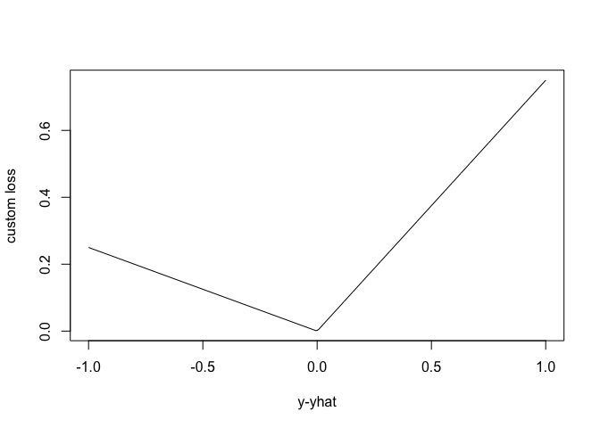
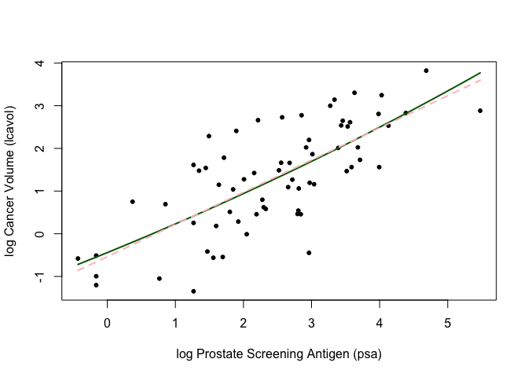
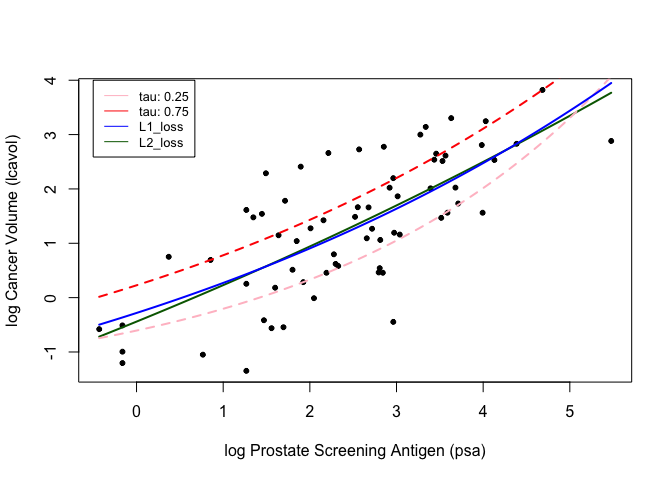

Homework 2
================
Ningyu Han
2023-01-27

## load prostate data

``` r
prostate <- 
  read.table(url(
    'https://web.stanford.edu/~hastie/ElemStatLearn/datasets/prostate.data'))
```

## subset to training examples

``` r
prostate_train <- subset(prostate, train==TRUE)
```

## plot lcavol vs lpsa

``` r
plot_psa_data <- function(dat=prostate_train) {
  plot(dat$lpsa, dat$lcavol,
       xlab="log Prostate Screening Antigen (psa)",
       ylab="log Cancer Volume (lcavol)",
       pch = 20)
}
plot_psa_data()
```

<!-- -->

############################ 

## regular linear regression

############################ 

## L1 loss function

``` r
L1_loss <- function(y, yhat)
  abs(y-yhat)
```

``` r
fit_lin_L1 <- function(y, x, loss=L1_loss, beta_init = c(-0.51, 0.75)) {
  err <- function(beta)
    mean(loss(y,  beta[1] + beta[2]*x))
  beta <- optim(par = beta_init, fn = err)
  return(beta)
}
```

``` r
predict_lin_L1 <- function(x, beta)
  beta[1] + beta[2]*x
```

``` r
lin_beta_L1 <- fit_lin_L1(y=prostate_train$lcavol,
                    x=prostate_train$lpsa,
                    loss=L1_loss)
```

``` r
x_grid <- seq(min(prostate_train$lpsa),
              max(prostate_train$lpsa),
              length.out=100)
lin_pred_L1 <- predict_lin_L1(x=x_grid, beta=lin_beta_L1$par)

## plot data
plot_psa_data()

## plot predictions
lines(x=x_grid, y=lin_pred_L1, col='darkgreen', lwd=2)

## do the same thing with 'lm'
lin_fit_lm <- lm(lcavol ~ lpsa, data=prostate_train)

## make predictions using 'lm' object
lin_pred_lm <- predict(lin_fit_lm, data.frame(lpsa=x_grid))

## plot predictions from 'lm'
lines(x=x_grid, y=lin_pred_lm, col='pink', lty=2, lwd=2)
```

<!-- -->

## L2 loss function

``` r
L2_loss <- function(y, yhat)
  (y-yhat)^2
```

## fit simple linear model using numerical optimization

``` r
fit_lin_L2 <- function(y, x, loss=L2_loss, beta_init = c(-0.51, 0.75)) {
  err <- function(beta)
    mean(loss(y,  beta[1] + beta[2]*x))
  beta <- optim(par = beta_init, fn = err)
  return(beta)
}
```

## make predictions from linear model

``` r
predict_lin_L2 <- function(x, beta)
  beta[1] + beta[2]*x
```

## fit linear model

``` r
lin_beta_L2 <- fit_lin_L2(y=prostate_train$lcavol,
                    x=prostate_train$lpsa,
                    loss=L2_loss)
```

## compute predictions for a grid of inputs

``` r
x_grid <- seq(min(prostate_train$lpsa),
              max(prostate_train$lpsa),
              length.out=100)
lin_pred_L2 <- predict_lin_L2(x=x_grid, beta=lin_beta_L2$par)

## plot data
plot_psa_data()

## plot predictions
lines(x=x_grid, y=lin_pred_L2, col='darkgreen', lwd=2)

## do the same thing with 'lm'
lin_fit_lm <- lm(lcavol ~ lpsa, data=prostate_train)

## make predictions using 'lm' object
lin_pred_lm <- predict(lin_fit_lm, data.frame(lpsa=x_grid))

## plot predictions from 'lm'
lines(x=x_grid, y=lin_pred_lm, col='pink', lty=2, lwd=2)
```

<!-- -->

################################## 

## try modifying the loss function

################################## 

## custom loss function

``` r
custom_loss_0.25 <- function(y, yhat)
  qrnn::tilted.abs(y-yhat, tau = 0.25)

custom_loss_0.75 <- function(y, yhat)
  qrnn::tilted.abs(y-yhat, tau = 0.75)
```

## plot custom loss function

``` r
err_grd_0.25 <- seq(-1,1,length.out=200)
plot(err_grd_0.25, custom_loss_0.25(err_grd_0.25,0), type='l',
     xlab='y-yhat', ylab='custom loss')
```

<!-- -->

``` r
err_grd_0.75 <- seq(-1,1,length.out=200)
plot(err_grd_0.75, custom_loss_0.75(err_grd_0.75,0), type='l',
     xlab='y-yhat', ylab='custom loss')
```

<!-- -->

## fit linear model with custom loss

``` r
lin_beta_custom_0.25 <- fit_lin_L2(y=prostate_train$lcavol,
                    x=prostate_train$lpsa,
                    loss=custom_loss_0.25)

lin_beta_custom_0.75 <- fit_lin_L2(y=prostate_train$lcavol,
                    x=prostate_train$lpsa,
                    loss=custom_loss_0.75)

lin_pred_custom_0.25 <- predict_lin_L2(x=x_grid, beta=lin_beta_custom_0.25$par)

lin_pred_custom_0.75 <- predict_lin_L2(x=x_grid, beta=lin_beta_custom_0.75$par)

## plot data
plot_psa_data()

## plot predictions from L2 loss
lines(x=x_grid, y=lin_pred_L2, col='darkgreen', lwd=2)

## plot predictions from custom loss, tau = 0.25
lines(x=x_grid, y=lin_pred_custom_0.25, col='pink', lwd=2, lty=2)

## plot predictions from custom loss, tau = 0.75
lines(x=x_grid, y=lin_pred_custom_0.75, col='red', lwd=2, lty=2)
```

<!-- -->

## Add plots together

``` r
plot_psa_data()

## plot predictions from L2 loss
lines(x=x_grid, y=lin_pred_L2, col='darkgreen', lwd=2)

## plot predictions from custom loss, tau = 0.25
lines(x=x_grid, y=lin_pred_custom_0.25, col='pink', lwd=2, lty=2)

## plot predictions from custom loss, tau = 0.75
lines(x=x_grid, y=lin_pred_custom_0.75, col='red', lwd=2, lty=2)

## plot from L1 loss
lines(x=x_grid, y=lin_pred_L1, col='blue', lwd=2)

## add legend
legend(-0.5, 4, 
       legend=c("tau: 0.25", "tau: 0.75", "L1_loss", "L2_loss"),
       col=c("pink", "red", "blue", "darkgreen"), 
       lty=1:1, cex=0.8)
```

<!-- -->

# Nonlinear Model

## L1 loss function

``` r
L1_loss_new <- function(y, yhat)
  abs(y-yhat)
```

``` r
fit_lin_L1_new <- function(y, x, loss=L1_loss_new, beta_init = c(-1.0, 0.0, -0.3)) {
  err <- function(beta)
    mean(loss(y,  beta[1] + beta[2]*exp(-beta[3]*x)))
  beta <- optim(par = beta_init, fn = err)
  return(beta)
}
```

``` r
predict_lin_L1_new <- function(x, beta)
  beta[1] + beta[2]*exp(-beta[3]*x)
```

``` r
lin_beta_L1_new <- fit_lin_L1_new(y=prostate_train$lcavol,
                    x=prostate_train$lpsa,
                    loss=L1_loss_new)
```

``` r
x_grid <- seq(min(prostate_train$lpsa),
              max(prostate_train$lpsa),
              length.out=100)
lin_pred_L1_new <- predict_lin_L1_new(x=x_grid, beta=lin_beta_L1_new$par)

## plot data
plot_psa_data()

## plot predictions
lines(x=x_grid, y=lin_pred_L1_new, col='darkgreen', lwd=2)

## do the same thing with 'lm'
lin_fit_lm <- lm(lcavol ~ lpsa, data=prostate_train)

## make predictions using 'lm' object
lin_pred_lm <- predict(lin_fit_lm, data.frame(lpsa=x_grid))

## plot predictions from 'lm'
lines(x=x_grid, y=lin_pred_lm, col='pink', lty=2, lwd=2)
```

<!-- -->

## L2 loss function

``` r
L2_loss_new <- function(y, yhat)
  (y-yhat)^2
```

``` r
fit_lin_L2_new <- function(y, x, loss=L2_loss_new, beta_init = c(-1.0, 0.0, -0.3)) {
  err <- function(beta)
    mean(loss(y,  beta[1] + beta[2]*exp(-beta[3]*x)))
  beta <- optim(par = beta_init, fn = err)
  return(beta)
}
```

``` r
predict_lin_L2_new <- function(x, beta)
  beta[1] + beta[2]*exp(-beta[3]*x)
```

``` r
lin_beta_L2_new <- fit_lin_L2_new(y=prostate_train$lcavol,
                    x=prostate_train$lpsa,
                    loss=L2_loss_new)
```

``` r
x_grid <- seq(min(prostate_train$lpsa),
              max(prostate_train$lpsa),
              length.out=100)
lin_pred_L2_new <- predict_lin_L2_new(x=x_grid, beta=lin_beta_L2_new$par)

## plot data
plot_psa_data()

## plot predictions
lines(x=x_grid, y=lin_pred_L2_new, col='darkgreen', lwd=2)

## do the same thing with 'lm'
lin_fit_lm <- lm(lcavol ~ lpsa, data=prostate_train)

## make predictions using 'lm' object
lin_pred_lm <- predict(lin_fit_lm, data.frame(lpsa=x_grid))

## plot predictions from 'lm'
lines(x=x_grid, y=lin_pred_lm, col='pink', lty=2, lwd=2)
```

<!-- -->

## custom loss function

``` r
custom_loss_0.25_new <- function(y, yhat)
  qrnn::tilted.abs(y-yhat, tau = 0.25)

custom_loss_0.75_new <- function(y, yhat)
  qrnn::tilted.abs(y-yhat, tau = 0.75)
```

## plot custom loss function

``` r
err_grd_0.25_new <- seq(-1,1,length.out=200)
plot(err_grd_0.25_new, custom_loss_0.25_new(err_grd_0.25_new,0), type='l',
     xlab='y-yhat', ylab='custom loss')
```

<!-- -->

``` r
err_grd_0.75_new <- seq(-1,1,length.out=200)
plot(err_grd_0.75_new, custom_loss_0.75_new(err_grd_0.75_new,0), type='l',
     xlab='y-yhat', ylab='custom loss')
```

<!-- -->

## fit linear model with custom loss

``` r
lin_beta_custom_0.25_new <- fit_lin_L2_new(y=prostate_train$lcavol,
                    x=prostate_train$lpsa,
                    loss=custom_loss_0.25_new)

lin_beta_custom_0.75_new <- fit_lin_L2_new(y=prostate_train$lcavol,
                    x=prostate_train$lpsa,
                    loss=custom_loss_0.75_new)

lin_pred_custom_0.25_new <- predict_lin_L2_new(x=x_grid, beta=lin_beta_custom_0.25_new$par)

lin_pred_custom_0.75_new <- predict_lin_L2_new(x=x_grid, beta=lin_beta_custom_0.75_new$par)

## plot data
plot_psa_data()

## plot predictions from L2 loss
lines(x=x_grid, y=lin_pred_L2_new, col='darkgreen', lwd=2)

## plot predictions from custom loss, tau = 0.25
lines(x=x_grid, y=lin_pred_custom_0.25, col='pink', lwd=2, lty=2)

## plot predictions from custom loss, tau = 0.75
lines(x=x_grid, y=lin_pred_custom_0.75, col='red', lwd=2, lty=2)
```

<!-- -->

## Add plots together

``` r
plot_psa_data()

## plot predictions from L2 loss
lines(x=x_grid, y=lin_pred_L2_new, col='darkgreen', lwd=2)

## plot predictions from custom loss, tau = 0.25
lines(x=x_grid, y=lin_pred_custom_0.25_new, col='pink', lwd=2, lty=2)

## plot predictions from custom loss, tau = 0.75
lines(x=x_grid, y=lin_pred_custom_0.75_new, col='red', lwd=2, lty=2)

## plot from L1 loss
lines(x=x_grid, y=lin_pred_L1_new, col='blue', lwd=2)

## add legend
legend(-0.5, 4, 
       legend=c("tau: 0.25", "tau: 0.75", "L1_loss", "L2_loss"),
       col=c("pink", "red", "blue", "darkgreen"), 
       lty=1:1, cex=0.8)
```

<!-- -->
